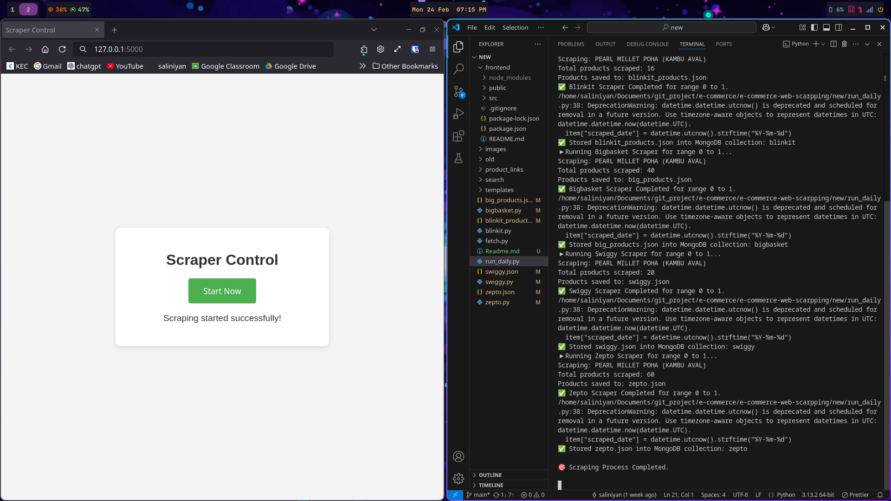
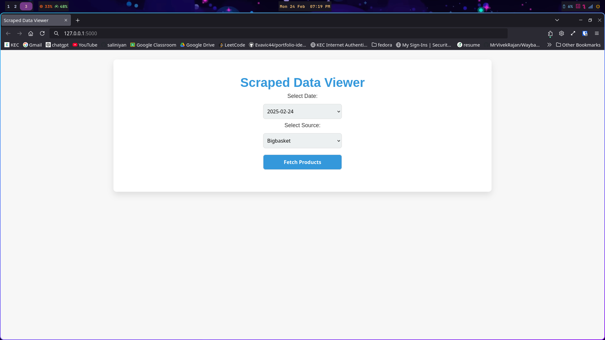
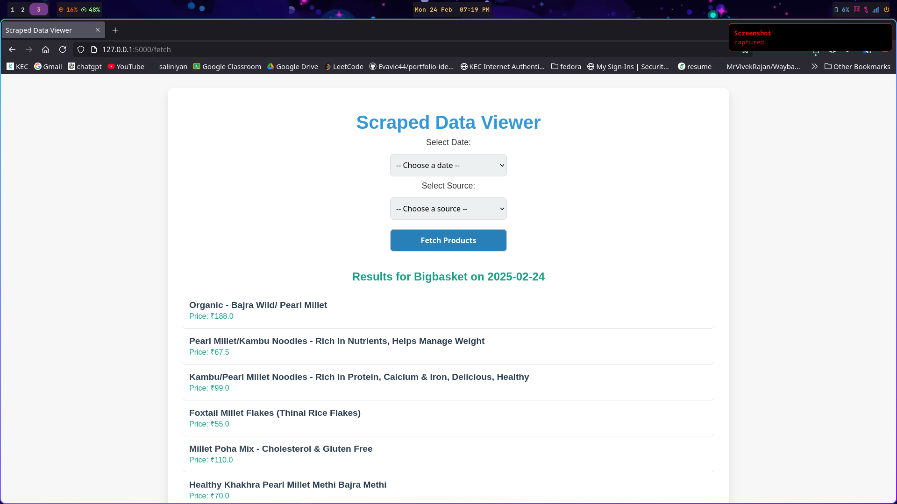
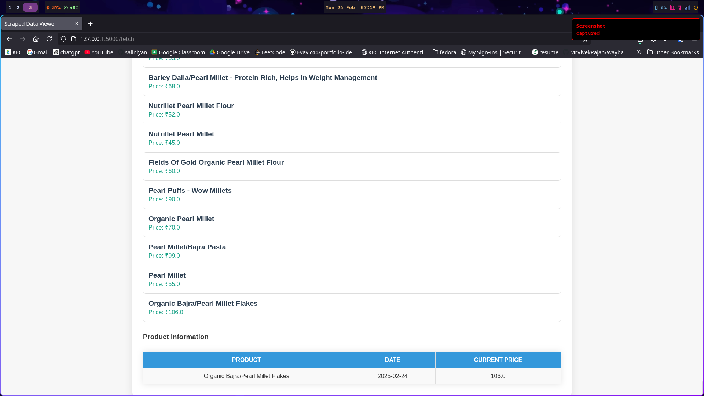
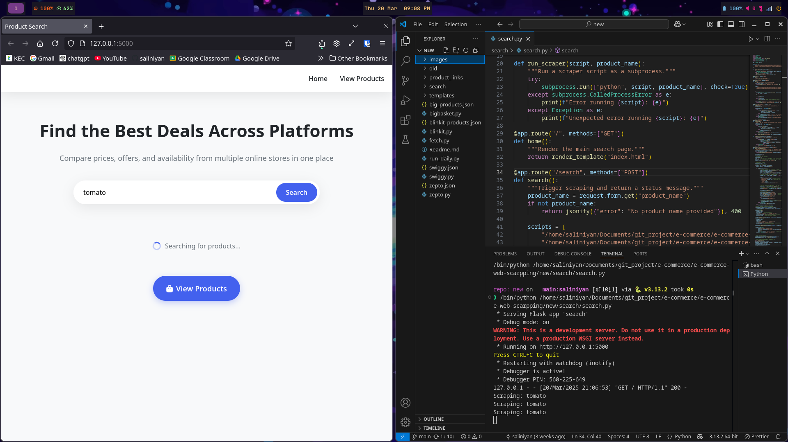
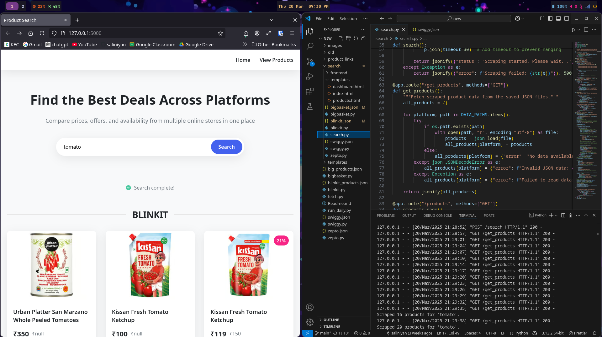
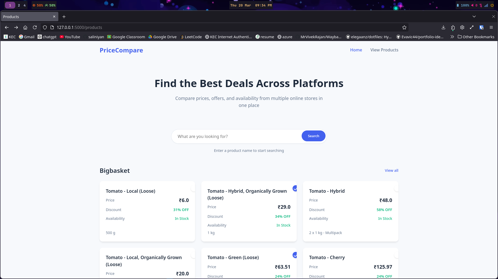
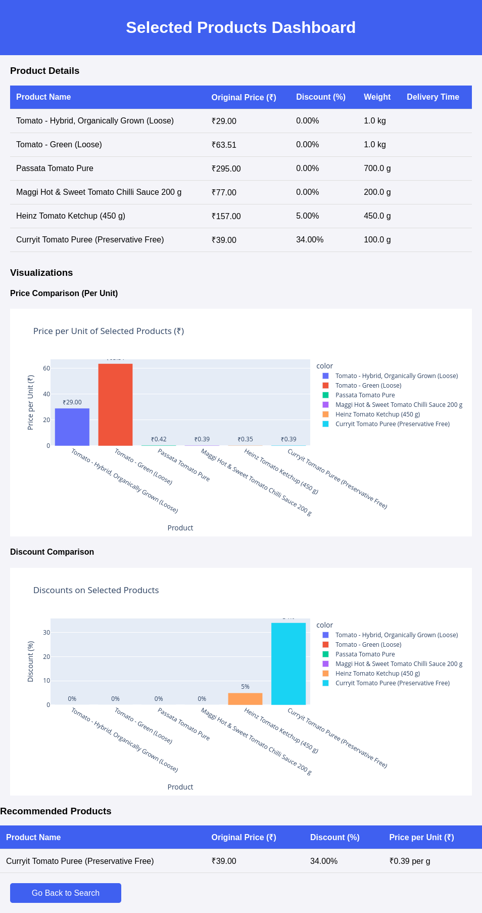

# E-commerce Web Scraping

This project is an e-commerce web scraping tool that extracts product information from multiple online grocery platforms, including BigBasket, Blinkit, Swiggy, and Zepto. The scraped data can be used for price comparison, market analysis, or other research purposes.

## Features

- **Multi-Platform Scraping**: Supports scraping data from BigBasket, Blinkit, Swiggy, and Zepto.
- **Automated Data Extraction**: Fetch product details provided in JSON format (1000+ products) such as name, price, brand, and availability on a daily basis.
- **JSON Data Storage**: Saves scraped data in JSON format for easy access, processing, and future modifications along with the time so that we can view the products based on date and web.
- **Daily Data Updates**: Includes a script to automate daily scraping.
- **Web Interface**: A simple front-end interface to display and search for scraped products.
- **Multi-Processing**: Utilizes 6 concurrent processes (configurable based on system capabilities) to scrape websites efficiently, handling 2500 products in 10 minutes.
- **Batch Processing**: This project utilizes batch scraping to avoid bans.

## Scrap Products on Instance (Search Folder)

- **Real-Time Product Scraping**: Enter a product name to scrape products in real-time and get instant results.
- **Comparison Dashboard**: After retrieving products, users can select specific ones to compare them using a dashboard, which recommends the best option based on unit price and available offers.

## Usage

- Run individual scrapers to fetch product data from different e-commerce platforms.
- Store the scraped data in JSON format.
- Use the `run_daily.py` script to automate scraping at scheduled intervals.
- Access the web interface to search and view scraped product details.

## Screenshots

### Trigger Scraping By Button 

### Select Date and Web to View Scraped Products

### View Products

### View Price History

## Search Module

### Search Products by Name

### View Scraped Products

### Choose Products to Compare

### View Dashboard

